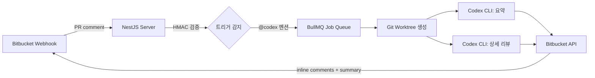

# bitbucket-codex-code-review

> Bitbucket PR webhook → Codex CLI 자동 코드 리뷰 → PR 코멘트 게시

Bitbucket PR에 `@codex` 멘션이 달리면 자동으로 코드 리뷰를 수행하고, 인라인 코멘트와 요약을 PR에 게시하는 워커 서비스.

## Architecture



## How It Works

1. **Webhook 수신** — Bitbucket `pullrequest:comment_created` 이벤트 수신
2. **트리거 감지** — `@codex` 멘션 감지 후 리뷰 작업 큐잉
3. **Worktree 준비** — Bare repo clone + git worktree 생성 (PR head commit)
4. **병렬 리뷰** — Codex CLI로 **요약** + **상세 리뷰** 병렬 실행
5. **결과 게시** — 인라인 코멘트 + summary table로 Bitbucket PR에 게시

## Prerequisites

**필수:**

- Node.js >= 24.0.0
- pnpm
- [Codex CLI](https://github.com/openai/codex) 설치

**인프라 (로컬 개발 시 Docker Compose로 자동 구성):**

- MySQL 8.4
- Redis

## Quick Start

### Local Development

```bash
# 1. 환경 변수 설정
cp .env.example .env
# .env 파일 편집: BITBUCKET_API_TOKEN, BITBUCKET_WEBHOOK_SECRET 등 설정

# 2. 의존성 설치
pnpm install

# 3. 인프라 (MySQL + Redis) 기동
docker compose up -d mysql redis

# 4. 개발 서버 시작
pnpm start:dev
```

### Docker Compose

```bash
# Bitbucket 인증 정보를 환경변수로 전달
export BITBUCKET_API_TOKEN=your_token
export BITBUCKET_WEBHOOK_SECRET=your_secret

docker compose up -d
```

## Configuration

### Core

| 환경변수 | 설명 | 기본값 |
|---|---|---|
| `PORT` | HTTP 서버 포트 | `3000` |
| `METRICS_PORT` | Prometheus 메트릭 포트 | `9463` |
| `NODE_ENV` | 환경 | `development` |
| `LOG_LEVEL` | 로그 레벨 | `info` |

### Database (MySQL)

| 환경변수 | 설명 | 기본값 |
|---|---|---|
| `DB_HOST` | MySQL 호스트 | `localhost` |
| `DB_PORT` | MySQL 포트 | `3309` |
| `DB_USERNAME` | DB 사용자 | `root` |
| `DB_PASSWORD` | DB 비밀번호 | - |
| `DB_NAME` | DB 이름 | `lxp_code_review` |
| `DB_POOL_SIZE` | 커넥션 풀 크기 | `5` |
| `DB_SYNCHRONIZE` | 스키마 자동 동기화 | `false` |

### Queue (Redis / BullMQ)

| 환경변수 | 설명 | 기본값 |
|---|---|---|
| `REDIS_QUEUE_HOST` | Redis 호스트 | `localhost` |
| `REDIS_QUEUE_PORT` | Redis 포트 | `6379` |
| `REDIS_QUEUE_PASSWORD` | Redis 비밀번호 | - |
| `REDIS_QUEUE_DB` | Redis DB 번호 | `0` |
| `QUEUE_RETRY_ATTEMPTS` | 재시도 횟수 | `3` |
| `QUEUE_RETRY_DELAY` | 재시도 딜레이 (ms) | `5000` |

### Codex CLI

| 환경변수 | 설명 | 기본값 |
|---|---|---|
| `CODEX_BINARY_PATH` | Codex CLI 바이너리 경로 | `codex` |
| `CODEX_MODEL` | 사용 모델 | `gpt-5.4` |
| `CODEX_REASONING_EFFORT` | 추론 노력도 (`low` / `medium` / `high` / `xhigh`) | `high` |
| `CODEX_TIMEOUT_MS` | 실행 타임아웃 (ms) | `600000` |

### Bitbucket

| 환경변수 | 설명 | 기본값 |
|---|---|---|
| `BITBUCKET_BASE_URL` | Bitbucket API 기본 URL | `https://api.bitbucket.org/2.0` |
| `BITBUCKET_API_TOKEN` | API 토큰 | - |
| `BITBUCKET_WEBHOOK_SECRET` | Webhook HMAC secret | - |
| `REVIEW_TRIGGER_MODE` | 트리거 모드 (`mention` / `auto` / `both`) | `mention` |

### Workspace

| 환경변수 | 설명 | 기본값 |
|---|---|---|
| `WORKSPACE_BASE_PATH` | 워크스페이스 경로 | `/tmp/code-review-workspaces` |
| `WORKSPACE_MAX_CONCURRENT` | 최대 동시 워크스페이스 수 | `3` |

> [!TIP]
> 전체 설정은 [`.env.example`](.env.example) 참조.

## Security

> [!IMPORTANT]
> Webhook secret이 설정되지 않으면 **모든 요청이 거부**됩니다 (fail-closed).

- **HMAC 검증** — Raw body 기반 SHA-256 서명 검증
- **Git 인증** — `GIT_ASKPASS` 방식 (URL에 토큰 미포함)
- **Path traversal 방지** — Repository slug sanitize + workspace root 검증
- **Payload 검증** — Webhook payload 필수 필드 타입 검증

## Scripts

```bash
pnpm build          # 프로덕션 빌드
pnpm start          # 프로덕션 실행
pnpm start:dev      # 개발 서버 (watch)
pnpm test           # 테스트 실행
pnpm test:cov       # 커버리지 포함 테스트
pnpm lint           # ESLint
```

## Kubernetes Deployment

Helm 차트가 `charts/code-review-worker/`에 포함되어 있습니다.

```bash
helm install code-review ./charts/code-review-worker \
  --set database.host=mysql \
  --set database.username=root \
  --set database.password=changeme \
  --set database.name=lxp_code_review \
  --set redis.host=redis \
  --set redis.password=pass \
  --set codexAuth.existingSecret=codex-auth
```

### Codex CLI 인증

Codex CLI는 `~/.codex/auth.json`에서 API 인증 정보를 읽습니다.
K8s 환경에서는 Secret을 생성하고 차트에서 `/root/.codex`로 마운트합니다.

```bash
# 로컬 인증 파일로 Secret 생성
kubectl create secret generic codex-auth \
  --from-file=auth.json=$HOME/.codex/auth.json

# Helm 설치 시 적용
helm install code-review ./charts/code-review-worker \
  --set codexAuth.existingSecret=codex-auth \
  # ... 기타 설정
```

> [!TIP]
> 프로덕션 환경에서는 External Secrets Operator나 Sealed Secrets를 사용하여 `existingSecret`을 관리하세요.

상세 설정은 [charts/code-review-worker/README.md](charts/code-review-worker/README.md) 참조.

## Project Structure

```
src/
├── webhook/          # Webhook 수신, HMAC guard, 트리거 감지
├── queue/            # BullMQ processor, 리뷰 포매터/타입
├── workspace/        # Git bare clone + worktree 관리
├── codex/            # Codex CLI 실행
├── bitbucket/        # Bitbucket API 클라이언트
├── review/           # ReviewRun entity + service
├── internal/         # 내부 API (클러스터 전용)
├── config/           # 환경변수 설정 + validation
├── database/         # TypeORM 모듈
├── entities/         # TypeORM entities
├── lib/              # 공유 유틸 (logger, OTel, DB)
└── main.ts           # 엔트리포인트
```
