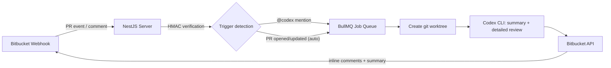

# bitbucket-codex-code-review

> Bitbucket PR webhook → automated Codex CLI code review → PR comments

*English · [한국어](README.ko.md)*

A worker service that reviews Bitbucket pull requests — triggered by an `@codex` mention or by the PR being opened or updated — and posts inline comments plus a summary back to the PR.

## Architecture


```mermaid
flowchart LR
    A[Bitbucket Webhook] -->|PR event / comment| B[NestJS Server]
    B -->|HMAC verification| C{Trigger detection}
    C -->|"@codex mention"| D[BullMQ Job Queue]
    C -->|"PR opened/updated (auto)"| D
    D --> E[Create git worktree]
    E --> F[Codex CLI: summary + detailed review]
    F --> G[Bitbucket API]
    G -->|inline comments + summary| A
```

## How It Works

1. **Receive webhook** — Bitbucket PR events (`pullrequest:created`, `pullrequest:updated`, `pullrequest:comment_created`)
2. **Detect trigger** — depending on the trigger mode, queue a review job automatically (PR opened/updated) or on an `@codex` mention
3. **Prepare worktree** — bare repo clone + git worktree at the PR head commit
4. **Single review pass** — one Codex CLI call produces the **summary, verdict, and detailed review**
5. **Post results** — verdict badge, inline comments, and a summary table on the Bitbucket PR

## Prerequisites

**Required:**

- Node.js >= 24.0.0
- pnpm
- [Codex CLI](https://github.com/openai/codex)

**Infrastructure (provisioned by Docker Compose for local development):**

- MySQL 26.7
- Redis

## Quick Start

### Local Development

```bash
# 1. Configure environment variables
cp .env.example .env
# Edit .env: set DASHBOARD_SECRET_KEY, SETTINGS_ENCRYPTION_KEY, and the values to import once
#   DASHBOARD_SECRET_KEY="$(openssl rand -base64 32)"   # at least 32 bytes
#   SETTINGS_ENCRYPTION_KEY="$(openssl rand -hex 16)"   # exactly 32 bytes

# 2. Install dependencies
pnpm install

# 3. Start infrastructure (MySQL + Redis)
docker compose up -d mysql redis

# 4. Initialize the schema (first run only) — this runs dist, so build first
pnpm build
pnpm database:prepare

# 5. Start the dev server
pnpm start:dev

# 6. Only when working on the dashboard — Vite dev server in a separate terminal
pnpm --filter dashboard dev
```

`pnpm build` runs `nest build` first and the dashboard's `vite build` after it. The order is fixed
because `nest-cli.json`'s `deleteOutDir` wipes `dist/` — the dashboard output lands in
`dist/dashboard/`, so running `nest build` later would delete it.

For the same reason `pnpm start:dev` (`nest start --watch`) clears `dist/dashboard/` on every
recompile. So do dashboard work against the Vite dev server on port 5173 (`/api` is proxied to
`localhost:3000`) and verify the combined output with `pnpm build && pnpm start`.

`database:prepare` and `migration:*` use a standalone TypeORM DataSource that never goes through
Nest's `ConfigModule`, so they only see `process.env`. package.json therefore passes `.env` in
directly with Node's `--env-file-if-exists=.env`. Environment variables already set in the shell or
container win over `.env` values, so Compose deployments behave exactly as before.

`REDIS_QUEUE_PORT` in `.env.example` is `6381`, the port Compose publishes on the host. Use it when
running the worker directly on the host; the worker inside Compose keeps using `redis:6379`.

Open the dashboard at `http://localhost:3000/dashboard` and enter `DASHBOARD_SECRET_KEY` on the lock
screen. To look at the UI without any review history, load the demo data:

```bash
mysql -h127.0.0.1 -P3309 -uroot -p"$DB_PASSWORD" lxp_code_review < scripts/seed-review-stats.sql
```

### Docker Compose

```bash
# Required bootstrap keys and the credentials imported on first boot
# Generate these once and keep them in .env or a secret manager. Regenerating them against an existing
# MySQL volume makes the stored runtime secrets undecryptable.
export DASHBOARD_SECRET_KEY="$(openssl rand -base64 32)"
export SETTINGS_ENCRYPTION_KEY="$(openssl rand -hex 16)"
export BITBUCKET_API_TOKEN=your_token
export BITBUCKET_WEBHOOK_SECRET=your_secret

docker compose up -d
```

In `database:prepare`, Compose initializes the current schema only on a clean volume (one without
`review_runs`), then applies migrations and starts the worker. An existing volume skips schema
synchronization and only runs migrations; if that fails, the application does not start. The
application's `DB_SYNCHRONIZE` is off, so the schema never changes after boot.

The development Redis host port is published on `127.0.0.1:6381` only. The worker inside Compose
still connects to `redis:6379`. None of this applies to production deployments, which live in a
separate infrastructure repository.

> [!IMPORTANT]
> Codex's branch-diff mode for large PRs uses a sandbox that runs `git` in the worktree. So that the sandbox's bubblewrap can create an unprivileged user namespace, `code-review-worker` must run with `seccomp:unconfined`. `CAP_SYS_ADMIN` and `privileged` are not needed. After deploying, check that `unshare --user --map-root-user true` succeeds inside the pod or container.

## Configuration

DB/Redis, ports, the workspace base path, the Bitbucket API base URL, the Codex binary path,
`DASHBOARD_SECRET_KEY` and `SETTINGS_ENCRYPTION_KEY` are bootstrap-static settings.
Every other review/integration setting is imported once from environment variables into MySQL on
first boot and managed from `/dashboard` afterwards. Changes apply to new webhooks and jobs without
restarting the pod.

### Core

| Variable | Description | Default |
|---|---|---|
| `PORT` | HTTP server port | `3000` |
| `METRICS_PORT` | Prometheus metrics port | `9463` |
| `NODE_ENV` | Environment | `development` |
| `LOG_LEVEL` | Log level | `info` |
| `DASHBOARD_SECRET_KEY` | Internal API bearer key (at least 32 bytes, required) | - |
| `SETTINGS_ENCRYPTION_KEY` | AES-256-GCM key for runtime secrets (exactly 32 bytes, required) | - |

### Database (MySQL)

| Variable | Description | Default |
|---|---|---|
| `DB_HOST` | MySQL host | `localhost` |
| `DB_PORT` | MySQL port | `3309` |
| `DB_USERNAME` | DB user | `root` |
| `DB_PASSWORD` | DB password | - |
| `DB_NAME` | DB name | `lxp_code_review` |
| `DB_POOL_SIZE` | Connection pool size | `5` |
| `DB_SYNCHRONIZE` | Automatic schema synchronization | `false` |

### Queue (Redis / BullMQ)

| Variable | Description | Default |
|---|---|---|
| `REDIS_QUEUE_HOST` | Redis host | `localhost` |
| `REDIS_QUEUE_PORT` | Redis port | `6379` |
| `REDIS_QUEUE_PASSWORD` | Redis password | - |
| `REDIS_QUEUE_DB` | Redis DB number | `0` |
| `QUEUE_RETRY_ATTEMPTS` | Total job attempts, imported once (1–10) | `3` |
| `QUEUE_RETRY_DELAY` | Retry delay in ms, imported once | `5000` |

### Codex CLI

| Variable | Description | Default |
|---|---|---|
| `CODEX_BINARY_PATH` | Path to the Codex CLI binary | `codex` |
| `CODEX_MODEL` | Model, imported once | `gpt-5.6-sol` |
| `CODEX_REASONING_EFFORT` | Reasoning effort, imported once | `medium` |
| `CODEX_TIMEOUT_MS` | Execution timeout in ms, imported once | `600000` |
| `OPENAI_API_KEY` | OpenAI API key, imported once | - |
| `OPENAI_BASE_URL` | HTTPS API endpoint, imported once (max 2,048 UTF-8 bytes) | - |
| `REVIEW_REPO_CUSTOM_PROMPT_FILEPATHS` | JSON map of repo slug → prompt file, imported once | - |
| `REVIEW_CUSTOM_PROMPT_FILEPATH` | Global prompt file, imported once | - |
| `RUNTIME_SETTINGS_REPOSITORY_WORKSPACE_MAP` | JSON map of repo slug → workspace slug, required for per-repo import | - |

### Bitbucket

| Variable | Description | Default |
|---|---|---|
| `BITBUCKET_BASE_URL` | Bitbucket API base URL | `https://api.bitbucket.org/2.0` |
| `BITBUCKET_API_TOKEN` | Global API token, imported once | - |
| `BITBUCKET_WEBHOOK_SECRET` | Global webhook HMAC secret, imported once | - |
| `REVIEW_TRIGGER_MODE` | Trigger mode, imported once | `mention` |

#### `REVIEW_TRIGGER_MODE` in detail

| Mode | PR opened/updated | `@codex` comment |
|------|:---:|:---:|
| `mention` (default) | ignored | review runs |
| `auto` | review runs | ignored |
| `both` | review runs | review runs |

> [!NOTE]
> In `auto` and `both` modes, `pullrequest:updated` events are handled as well. Reviewing the same commit hash twice is prevented by the idempotency key.
> To review the same commit again, comment `@codex --force` on the PR — this works in any trigger mode. Webhook redeliveries are deduplicated by comment ID.
> An `@codex` mention that gets filtered out as a duplicate receives a reply explaining why (no code changes / review already running). Automatic triggers are ignored silently, with no reply.
>
> To use a different model for one review only, write `@codex --model:gpt-6-astra` (`--model=` and `--model ` work too). Without it, the model resolves from the dashboard's repository setting, then global, then the code default.

### Workspace

| Variable | Description | Default |
|---|---|---|
| `WORKSPACE_BASE_PATH` | Workspace path | `/tmp/code-review-workspaces` |
| `WORKSPACE_MAX_CONCURRENT` | Worker concurrency, imported once (1–32) | `3` |
| `GIT_CLONE_TIMEOUT_MS` | Bare clone timeout in ms, imported once | `600000` |

Workspace and repository identifiers are path-encoded so that dots survive and nothing collides on a case-insensitive filesystem. If an existing bare cache's `origin` differs from the requested repository, the job fails before fetching and the cache is not deleted automatically. If an older version stored `foo.bar` under `foobar.git`, drain the related jobs, check that cache's `origin`, and have an operator move or clean it up by hand.

> [!TIP]
> See [`.env.example`](.env.example) for the full set of settings.

### First runtime-settings cutover

1. Stop webhook ingress.
2. Drain every queued, retrying, and running job on the old image using its `job.data.model`.
3. Remove both the raw job ID and the `review-${base64url(legacyKey)}` job ID for each legacy idempotency key, and confirm that no runnable or recoverable job is left.
4. List the workspace for every per-repo import key in `RUNTIME_SETTINGS_REPOSITORY_WORKSPACE_MAP`. The importer fails on a missing entry.
5. Deploy the new image. Docker Compose starts the worker only after `database:prepare` finishes the migrations; other deployment environments must run `pnpm database:prepare` before the application starts.
6. Verify on every instance that the runtime settings were imported and the worker concurrency applied.
7. Resume webhook ingress.

This migration's conversion to workspace-qualified idempotency keys cannot be undone. Once it has been applied, do not roll back by swapping in the legacy image alone. Either deploy a compatible fixed image, or stop webhook ingress, drain every new-format job, and restore the pre-deployment DB backup together with the matching environment variables.
When several instances start at once, a MySQL advisory lock serializes everything from schema preparation through writing the migration ledger. The idempotency key conversion commits alongside a separate transaction marker; if the conversion fails midway both roll back and the next run retries.

## Security

> [!IMPORTANT]
> If no webhook secret is configured, **every request is rejected** (fail-closed).

- **HMAC verification** — SHA-256 signature over the raw body
- **Webhook rate limiting** — the signature format, raw body, and repository identifier are checked first; secret lookups are capped process-wide at 120 per fixed 60-second window. A well-formed but wrongly signed request consumes the budget too, and once it is exhausted the service returns `429` with a `Retry-After` in seconds, without touching the DB. Legitimate requests share the same budget, so heavy traffic or multiple instances need a separate ingress or distributed limit.
- **Runtime secret storage** — MySQL holds only per-scope AES-256-GCM ciphertext; the API returns just `configured` and `source`
- **Dashboard authentication** — every `/api/internal/*` request requires `Authorization: Bearer <DASHBOARD_SECRET_KEY>`
- **Git authentication** — via `GIT_ASKPASS`, so no token ends up in a URL
- **Path traversal / repository isolation** — identifier validation, collision-free path encoding, workspace root and cached origin checks
- **Payload validation** — required webhook payload fields are type-checked

## Scripts

```bash
pnpm build          # production build
pnpm database:prepare # initialize a clean DB (first run) + apply pending migrations
pnpm migration:run    # apply pending migrations to an existing DB
pnpm start          # production run
pnpm start:dev      # dev server (watch)
pnpm test           # run tests
pnpm test:cov       # tests with coverage
pnpm lint           # ESLint + svelte-check (report only, no fixes)
pnpm lint:fix       # ESLint with --fix
```

## Internal API

The API behind the dashboard and operational tooling. Every route requires
`Authorization: Bearer <DASHBOARD_SECRET_KEY>` and responds with `Cache-Control: no-store`.

| Method | Path | Description |
|---|---|---|
| `GET` | `/api/internal/settings` | redacted runtime settings |
| `PATCH` | `/api/internal/settings/global` | CAS update of global settings |
| `PATCH` | `/api/internal/settings/repositories/:workspaceSlug/:repoSlug` | CAS update of a repository override |
| `GET` | `/api/internal/reviews/recent?limit=` | recent reviews (limit 1..50, default 10) |
| `GET` | `/api/internal/reviews/:id` | one review run in detail |
| `GET` | `/api/internal/reviews/:workspaceSlug/:repoSlug/:prId/latest` | latest review for a PR |
| `GET` | `/api/internal/stats/repos` | summary statistics per workspace/repo |
| `GET` | `/api/internal/stats/repos/:workspaceSlug/:repoSlug` | cumulative statistics for one workspace/repo |

A repo statistics response carries the review count, Codex and total durations, input/cached/output token totals, and metadata for the latest review.

## Local Dashboard

The built-in dashboard lives at `GET /dashboard`. The `DASHBOARD_SECRET_KEY` you enter on the lock screen is attached as the bearer header on every `/api/internal/*` read and write. The key stays in browser memory only, so a refresh, a logout, or a 401 means entering it again. Runtime secrets show their configured/inherited state instead of their value.

Locking, or a 401, also clears any global and repository secrets you were typing along with the custom prompt. Async responses started in an earlier session do not touch the state of the session you logged back into. The network exposure policy for `/api/internal/*` in production has to be confirmed in the infrastructure repository; what is known so far is recorded in [#83](https://github.com/azyu/bitbucket-codex-code-review/issues/83).

### Structure

`dashboard/` is a Vite + Svelte 5 + TypeScript package and a pnpm workspace member. Its output is
static files built into `dist/dashboard/`, served by a single static mount in `main.ts` under the
`/dashboard` prefix. It has no runtime dependencies — every dependency of the package is a
devDependency, so `pnpm install --prod` installs nothing for it.

Everything under `/dashboard` gets the relaxed CSP. Because Vite emits content-hashed filenames, the
single `isDashboardPath()` prefix check in `src/dashboard-csp.ts` covers the document and all its
assets (replacing an older structure that duplicated an exact-match list in two places). The current
policy is `script-src 'self'` / `style-src 'self'`, stricter than helmet's defaults on every
directive.

| What is verified | Where |
|---|---|
| Bearer key in memory only, full lock on 401, stale sessions, secrets never exposed, CAS | `dashboard/src/lib/store.spec.ts` |
| No protected content in the unauthenticated document | `dashboard/src/lib/shell.spec.ts` |
| CSP never relaxed further, `/dashboard` prefix check | `src/dashboard-csp.spec.ts` |

## Codex CLI Authentication

On the first deployment, the `OPENAI_API_KEY` and HTTPS `OPENAI_BASE_URL` environment variables are imported into runtime settings. From then on both are managed from the dashboard, and each new job reads them as a single connection snapshot from the same DB revision. Codex runs with only the API key passed through as an allowlisted child env var, and the CLI is given an explicit `model_provider="openai"` and `openai_base_url`.

### Alternative: mounting `auth.json`

Mount the `~/.codex/auth.json` that `codex login` creates at `/root/.codex` in the container. See the commented-out volume entry in `docker-compose.yml`.

To use branch-diff reviews for large PRs, Codex's bubblewrap must be able to create an unprivileged user namespace. `docker-compose.yml` applies `security_opt: seccomp:unconfined` to the worker. `CAP_SYS_ADMIN` and `privileged` are not needed. Check that `unshare --user --map-root-user true` succeeds inside the container.

> [!NOTE]
> Mounting `auth.json` is the bootstrap-static alternative. If an OpenAI API key is set in the dashboard, the dashboard's HTTPS endpoint also takes precedence over Codex's `config.toml`.

> [!TIP]
> In production, use a secret manager and pin the image tag to a git SHA rather than `latest`.

## Project Structure

```
src/
├── webhook/          # Webhook intake, HMAC guard, trigger detection
├── queue/            # BullMQ processor, review formatter/types
├── workspace/        # Git bare clone + worktree management
├── codex/            # Codex CLI execution
├── bitbucket/        # Bitbucket API client
├── review/           # ReviewRun entity + service
├── internal/         # Internal API (cluster only)
├── config/           # Environment variable config + validation
├── database/         # TypeORM module
├── entities/         # TypeORM entities
├── lib/              # Shared utilities (logger, OTel, DB)
└── main.ts           # Entry point
```
