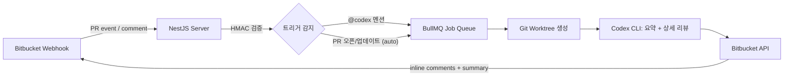

# bitbucket-codex-code-review

> Bitbucket PR webhook → Codex CLI 자동 코드 리뷰 → PR 코멘트 게시

Bitbucket PR에 `@codex` 멘션 또는 PR 오픈/업데이트 시 자동으로 코드 리뷰를 수행하고, 인라인 코멘트와 요약을 PR에 게시하는 워커 서비스.

## Architecture


```mermaid
flowchart LR
    A[Bitbucket Webhook] -->|PR event / comment| B[NestJS Server]
    B -->|HMAC 검증| C{트리거 감지}
    C -->|"@codex 멘션"| D[BullMQ Job Queue]
    C -->|"PR 오픈/업데이트 (auto)"| D
    D --> E[Git Worktree 생성]
    E --> F[Codex CLI: 요약 + 상세 리뷰]
    F --> G[Bitbucket API]
    G -->|inline comments + summary| A
```

## How It Works

1. **Webhook 수신** — Bitbucket PR 이벤트 (`pullrequest:created`, `pullrequest:updated`, `pullrequest:comment_created`) 수신
2. **트리거 감지** — 트리거 모드에 따라 자동(PR 오픈/업데이트) 또는 멘션(`@codex`) 기반으로 리뷰 작업 큐잉
3. **Worktree 준비** — Bare repo clone + git worktree 생성 (PR head commit)
4. **통합 리뷰** — Codex CLI로 **요약 + verdict + 상세 리뷰** 단일 호출
5. **결과 게시** — verdict badge + 인라인 코멘트 + summary table로 Bitbucket PR에 게시

## Prerequisites

**필수:**

- Node.js >= 24.0.0
- pnpm
- [Codex CLI](https://github.com/openai/codex) 설치

**인프라 (로컬 개발 시 Docker Compose로 자동 구성):**

- MySQL 26.7
- Redis

## Quick Start

### Local Development

```bash
# 1. 환경 변수 설정
cp .env.example .env
# .env 파일 편집: DASHBOARD_SECRET_KEY, SETTINGS_ENCRYPTION_KEY와 최초 이관 값을 설정

# 2. 의존성 설치
pnpm install

# 3. 인프라 (MySQL + Redis) 기동
docker compose up -d mysql redis

# 4. 개발 서버 시작
pnpm start:dev
```

### Docker Compose

```bash
# 필수 bootstrap key와 최초 이관용 자격증명
# 아래 값은 최초 1회만 생성해 .env/secret manager에 저장합니다. 기존 MySQL volume에서 재생성하면 저장된 runtime secret을 복호화할 수 없습니다.
export DASHBOARD_SECRET_KEY="$(openssl rand -base64 32)"
export SETTINGS_ENCRYPTION_KEY="$(openssl rand -hex 16)"
export BITBUCKET_API_TOKEN=your_token
export BITBUCKET_WEBHOOK_SECRET=your_secret

docker compose up -d
```

Compose는 `database:prepare`에서 `review_runs`가 없는 clean volume만 현재 schema로 초기화한 뒤 migration을 적용하고 worker를 시작합니다. 기존 volume은 schema 동기화를 건너뛰고 migration만 실행하며, 실패 시 애플리케이션을 시작하지 않습니다. 애플리케이션의 `DB_SYNCHRONIZE`는 비활성화되어 부팅 뒤 schema 변경은 없습니다.

> [!IMPORTANT]
> Codex의 대형 PR branch-diff 모드는 worktree에서 `git`을 실행하는 sandbox를 사용합니다. 이 sandbox의 bubblewrap이 비특권 user namespace를 만들 수 있도록 `code-review-worker`는 `seccomp:unconfined`로 실행해야 합니다. `CAP_SYS_ADMIN`이나 `privileged`는 필요하지 않습니다. 배포 후 파드/컨테이너에서 `unshare --user --map-root-user true`가 성공하는지 확인하세요.

## Configuration

DB/Redis, 포트, workspace base path, Bitbucket API base URL, Codex binary path,
`DASHBOARD_SECRET_KEY`, `SETTINGS_ENCRYPTION_KEY`는 bootstrap-static 설정입니다.
나머지 리뷰/연동 설정은 최초 부팅 때 환경변수에서 MySQL로 한 번 이관되고 이후
`/dashboard`에서 관리합니다. Pod 재시작 없이 새 webhook/job부터 적용됩니다.

### Core

| 환경변수 | 설명 | 기본값 |
|---|---|---|
| `PORT` | HTTP 서버 포트 | `3000` |
| `METRICS_PORT` | Prometheus 메트릭 포트 | `9463` |
| `NODE_ENV` | 환경 | `development` |
| `LOG_LEVEL` | 로그 레벨 | `info` |
| `DASHBOARD_SECRET_KEY` | 내부 API Bearer key (최소 32 bytes, 필수) | - |
| `SETTINGS_ENCRYPTION_KEY` | runtime secret AES-256-GCM key (정확히 32 bytes, 필수) | - |

### Database (MySQL)

| 환경변수 | 설명 | 기본값 |
|---|---|---|
| `DB_HOST` | MySQL 호스트 | `localhost` |
| `DB_PORT` | MySQL 포트 | `3309` |
| `DB_USERNAME` | DB 사용자 | `root` |
| `DB_PASSWORD` | DB 비밀번호 | - |
| `DB_NAME` | DB 이름 | `lxp_code_review` |
| `DB_POOL_SIZE` | 커넥션 풀 크기 | `5` |
| `DB_SYNCHRONIZE` | 스키마 자동 동기화 | `false` |

### Queue (Redis / BullMQ)

| 환경변수 | 설명 | 기본값 |
|---|---|---|
| `REDIS_QUEUE_HOST` | Redis 호스트 | `localhost` |
| `REDIS_QUEUE_PORT` | Redis 포트 | `6379` |
| `REDIS_QUEUE_PASSWORD` | Redis 비밀번호 | - |
| `REDIS_QUEUE_DB` | Redis DB 번호 | `0` |
| `QUEUE_RETRY_ATTEMPTS` | 최초 이관할 잡 총 시도 횟수 (1–10) | `3` |
| `QUEUE_RETRY_DELAY` | 최초 이관할 재시도 딜레이 (ms) | `5000` |

### Codex CLI

| 환경변수 | 설명 | 기본값 |
|---|---|---|
| `CODEX_BINARY_PATH` | Codex CLI 바이너리 경로 | `codex` |
| `CODEX_MODEL` | 최초 이관할 모델 | `gpt-5.6-sol` |
| `CODEX_REASONING_EFFORT` | 최초 이관할 추론 노력도 | `medium` |
| `CODEX_TIMEOUT_MS` | 최초 이관할 실행 타임아웃 (ms) | `600000` |
| `OPENAI_API_KEY` | 최초 이관할 OpenAI API 키 | - |
| `OPENAI_BASE_URL` | 최초 이관할 HTTPS API endpoint | - |
| `REVIEW_REPO_CUSTOM_PROMPT_FILEPATHS` | 최초 이관할 repo slug별 프롬프트 파일 JSON 맵 | - |
| `REVIEW_CUSTOM_PROMPT_FILEPATH` | 최초 이관할 전역 프롬프트 파일 | - |
| `RUNTIME_SETTINGS_REPOSITORY_WORKSPACE_MAP` | repo별 이관에 필요한 repo slug → workspace slug JSON 맵 | - |

### Bitbucket

| 환경변수 | 설명 | 기본값 |
|---|---|---|
| `BITBUCKET_BASE_URL` | Bitbucket API 기본 URL | `https://api.bitbucket.org/2.0` |
| `BITBUCKET_API_TOKEN` | 최초 이관할 global API token | - |
| `BITBUCKET_WEBHOOK_SECRET` | 최초 이관할 global webhook HMAC secret | - |
| `REVIEW_TRIGGER_MODE` | 최초 이관할 트리거 모드 | `mention` |

#### `REVIEW_TRIGGER_MODE` 상세

| 모드 | PR 오픈/업데이트 시 | `@codex` 댓글 시 |
|------|:---:|:---:|
| `mention` (기본) | 무시 | 리뷰 실행 |
| `auto` | 리뷰 실행 | 무시 |
| `both` | 리뷰 실행 | 리뷰 실행 |

> [!NOTE]
> `auto`/`both` 모드에서 `pullrequest:updated` 이벤트도 처리됩니다. 동일 commit hash에 대한 중복 리뷰는 idempotency key로 자동 방지됩니다.
> 동일 commit을 다시 리뷰하려면 트리거 모드와 관계없이 PR 댓글에 `@codex --force`를 입력합니다. 댓글 ID를 기준으로 웹훅 재전송은 중복 방지됩니다.
>
> 이번 리뷰에만 다른 모델을 쓰려면 `@codex --model:gpt-6-astra`처럼 지정합니다(`--model=`, `--model ` 형식도 동일). 지정하지 않으면 대시보드의 repository → global → 코드 기본값 순서로 해석합니다.

### Workspace

| 환경변수 | 설명 | 기본값 |
|---|---|---|
| `WORKSPACE_BASE_PATH` | 워크스페이스 경로 | `/tmp/code-review-workspaces` |
| `WORKSPACE_MAX_CONCURRENT` | 최초 이관할 worker concurrency (1–32) | `3` |
| `GIT_CLONE_TIMEOUT_MS` | 최초 이관할 bare clone 타임아웃 (ms) | `600000` |

> [!TIP]
> 전체 설정은 [`.env.example`](.env.example) 참조.

### 최초 runtime settings cutover

1. Webhook ingress를 중단합니다.
2. 기존 queued/retrying/running job을 기존 이미지의 `job.data.model`로 모두 drain합니다.
3. 각 legacy idempotency key의 raw job ID와 `review-${base64url(legacyKey)}` job ID를 제거하고 실행/복구 가능한 job이 0인지 확인합니다.
4. `RUNTIME_SETTINGS_REPOSITORY_WORKSPACE_MAP`에 모든 repo별 import key의 workspace를 명시합니다. 누락되면 importer가 실패합니다.
5. 새 이미지를 배포합니다. Docker Compose는 `database:prepare`가 migration을 완료한 뒤 worker를 시작하며, 외부 배포 환경은 애플리케이션 시작 전에 `pnpm database:prepare`를 실행해야 합니다.
6. 모든 인스턴스에서 runtime settings import 및 worker concurrency 적용을 확인합니다.
7. Webhook ingress를 재개합니다.

이 migration의 workspace-qualified idempotency key 변환은 되돌릴 수 없습니다. Migration 적용 뒤에는 legacy 이미지만 교체해 rollback하면 안 됩니다. 호환되는 수정 이미지를 배포하거나, webhook ingress를 중단하고 새 형식 job을 모두 drain한 뒤 배포 전 DB backup과 환경변수 설정을 함께 복원해야 합니다.
여러 인스턴스가 동시에 시작하면 MySQL advisory lock이 schema 준비와 migration ledger 기록까지 직렬화합니다. Idempotency key 변환은 별도 transaction marker와 함께 commit되며, 변환 중 실패하면 둘 다 rollback되어 다음 실행이 재시도합니다.

## Security

> [!IMPORTANT]
> Webhook secret이 설정되지 않으면 **모든 요청이 거부**됩니다 (fail-closed).

- **HMAC 검증** — Raw body 기반 SHA-256 서명 검증
- **Runtime secret 저장** — MySQL에는 scope별 AES-256-GCM ciphertext만 저장하며 API는 `configured`/`source`만 반환
- **Dashboard 인증** — 모든 `/api/internal/*` 요청에 `Authorization: Bearer <DASHBOARD_SECRET_KEY>` 필요
- **Git 인증** — `GIT_ASKPASS` 방식 (URL에 토큰 미포함)
- **Path traversal 방지** — Repository slug sanitize + workspace root 검증
- **Payload 검증** — Webhook payload 필수 필드 타입 검증

## Scripts

```bash
pnpm build          # 프로덕션 빌드
pnpm database:prepare # clean DB 초기화(최초 1회) + pending migration 적용
pnpm migration:run    # 기존 DB의 pending migration 적용
pnpm start          # 프로덕션 실행
pnpm start:dev      # 개발 서버 (watch)
pnpm test           # 테스트 실행
pnpm test:cov       # 커버리지 포함 테스트
pnpm lint           # ESLint
```

## Internal API

대시보드/운영 도구용 API입니다. 모든 route가
`Authorization: Bearer <DASHBOARD_SECRET_KEY>`를 요구하고 `Cache-Control: no-store`를 반환합니다.

| Method | Path | 설명 |
|---|---|---|
| `GET` | `/api/internal/settings` | redacted runtime settings 조회 |
| `PATCH` | `/api/internal/settings/global` | global 설정 CAS 갱신 |
| `PATCH` | `/api/internal/settings/repositories/:workspaceSlug/:repoSlug` | repository override CAS 갱신 |
| `GET` | `/api/internal/reviews/:id` | 리뷰 실행 1건 상세 조회 |
| `GET` | `/api/internal/reviews/:workspaceSlug/:repoSlug/:prId/latest` | 특정 PR의 최신 리뷰 조회 |
| `GET` | `/api/internal/stats/repos` | workspace/repo별 요약 통계 목록 |
| `GET` | `/api/internal/stats/repos/:workspaceSlug/:repoSlug` | 특정 workspace/repo의 누적 요약 통계 |

repo 통계 응답에는 리뷰 건수, Codex/전체 소요 시간, input/cached/output token 합계, 최신 리뷰 메타데이터가 포함됩니다.

## Local Dashboard

내장 대시보드는 `GET /dashboard`에서 확인합니다. 잠금 화면에 `DASHBOARD_SECRET_KEY`를 입력하면 모든 `/api/internal/*` 조회/수정 요청에 Bearer header로 사용합니다. Key는 브라우저 메모리에만 남으므로 새로고침·로그아웃·401 뒤에는 다시 입력해야 합니다. Runtime secret은 값 대신 configured/inherited 상태만 표시됩니다.

## Codex CLI 인증

최초 배포에서는 `OPENAI_API_KEY`와 HTTPS `OPENAI_BASE_URL` 환경변수가 runtime settings로 이관됩니다. 이후 대시보드에서 함께 관리하며 새 job 시작 시 같은 DB revision에서 하나의 connection snapshot으로 읽습니다. Codex 실행은 API key만 allowlist child env로 전달하고 CLI에 `model_provider="openai"`와 `openai_base_url`을 명시합니다.

### `auth.json` 볼륨 마운트 대안

`codex login`으로 생성되는 `~/.codex/auth.json`을 컨테이너의 `/root/.codex`에 마운트합니다. `docker-compose.yml`의 주석 처리된 볼륨 항목을 참고하세요.

대형 PR의 branch-diff 리뷰를 사용하려면 Codex bubblewrap이 비특권 user namespace를 만들 수 있어야 합니다. `docker-compose.yml`은 워커에 `security_opt: seccomp:unconfined`를 적용합니다. `CAP_SYS_ADMIN`이나 `privileged`는 필요하지 않습니다. 컨테이너 안에서 `unshare --user --map-root-user true`가 성공하는지 확인하세요.

> [!NOTE]
> `auth.json` mount는 bootstrap-static 대안입니다. 대시보드 OpenAI API key를 사용하는 경우 HTTPS endpoint도 대시보드 값이 Codex `config.toml`보다 우선합니다.

> [!TIP]
> 프로덕션 환경에서는 시크릿 매니저를 사용하고, 이미지 태그는 `latest`가 아니라 git SHA로 고정하세요.

## Project Structure

```
src/
├── webhook/          # Webhook 수신, HMAC guard, 트리거 감지
├── queue/            # BullMQ processor, 리뷰 포매터/타입
├── workspace/        # Git bare clone + worktree 관리
├── codex/            # Codex CLI 실행
├── bitbucket/        # Bitbucket API 클라이언트
├── review/           # ReviewRun entity + service
├── internal/         # 내부 API (클러스터 전용)
├── config/           # 환경변수 설정 + validation
├── database/         # TypeORM 모듈
├── entities/         # TypeORM entities
├── lib/              # 공유 유틸 (logger, OTel, DB)
└── main.ts           # 엔트리포인트
```
